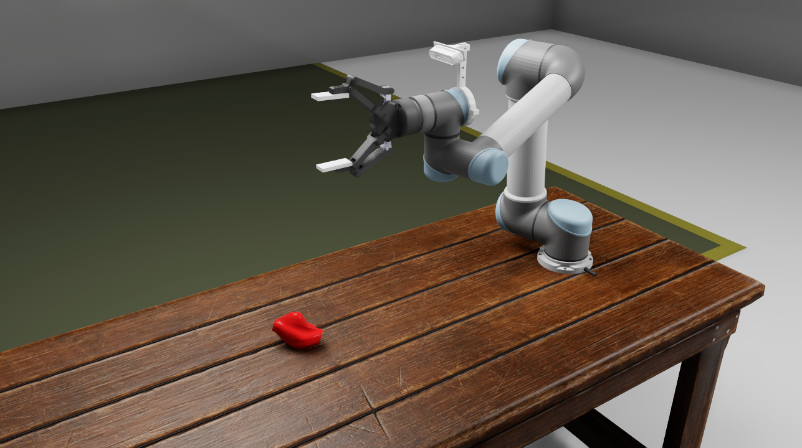
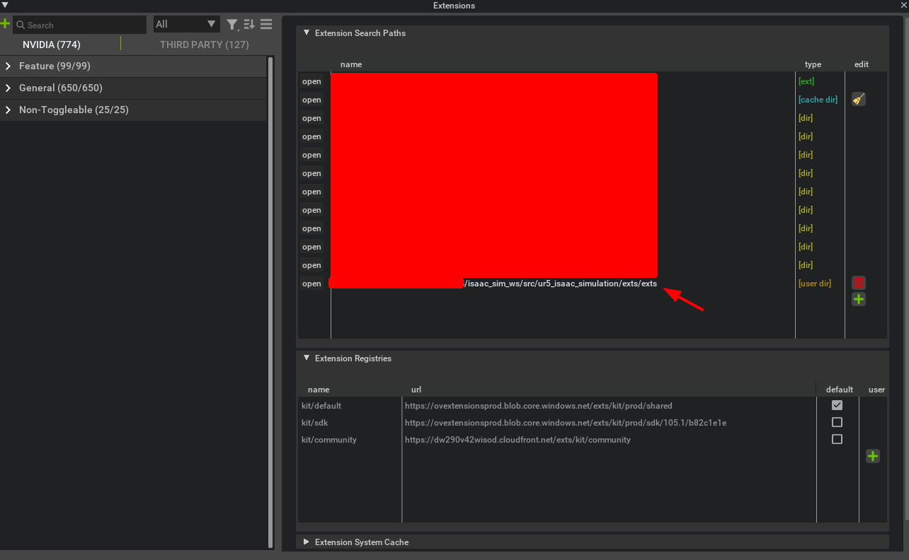
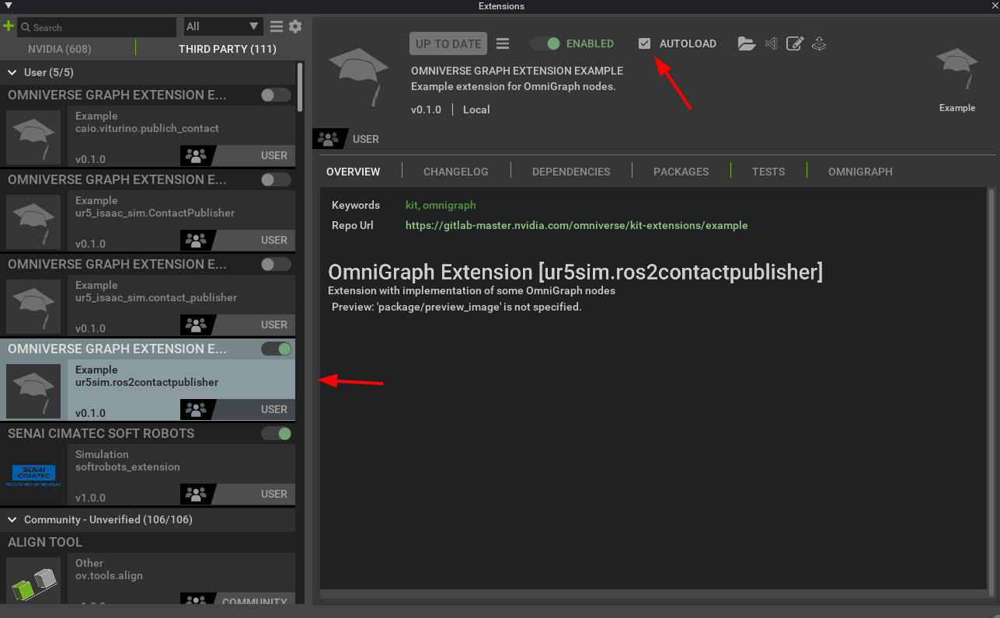
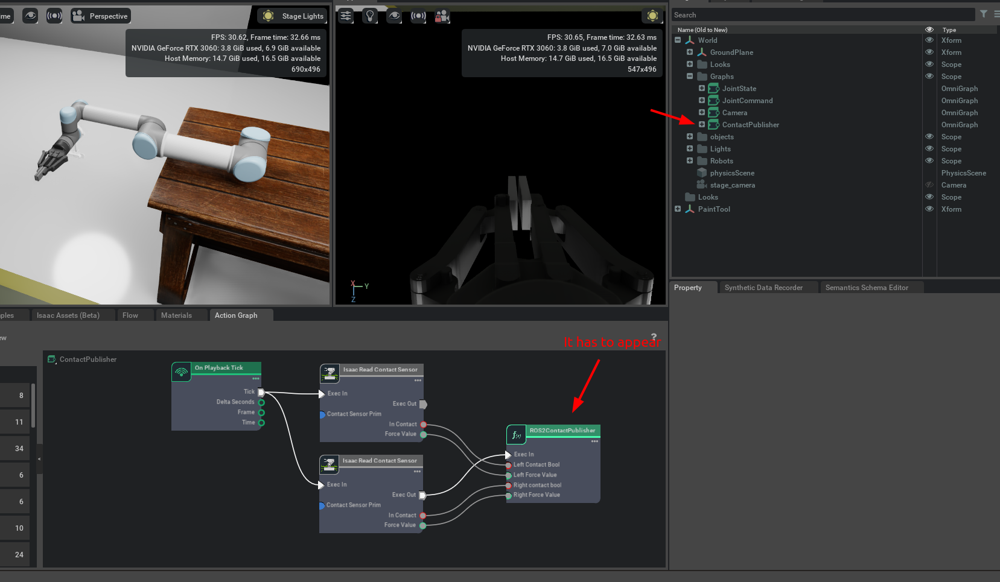
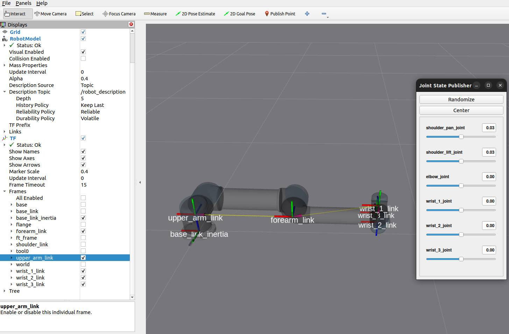

- [1. Overview](#1-overview)
- [2. Maintainer](#2-maintainer)
- [3. Installation](#3-installation)
  - [3.1. Extension Activation](#31-extension-activation)
  - [3.2. Dependencies](#32-dependencies)
- [4. Run Isaac Sim](#4-run-isaac-sim)
  - [4.1. Troubleshooting](#41-troubleshooting)
- [5. Build](#5-build)
- [6. Debug](#6-debug)
- [7. (Optional) Visualize UR5 Frames using the Universal ROS2 Package](#7-optional-visualize-ur5-frames-using-the-universal-ros2-package)


---
<a name="overview"></a>
# 1. Overview



This repository contains the environment to run and test algorithms for the UR5 of the Laboratory of Robotics at Federal University of Bahia (UFBA). It is possible to test sensors integrations such as RGB+D cameras, generate point clouds, etc.

⚠️ The main reason to use this repository is to avoid damaging the robot with untested algorithms such as trajectory planning, grasping generators, etc.


**Keywords:** Robot manipulators, UR5 Simulation, LaR UFBA

---
<a name="maintainer"></a>
# 2. Maintainer

**Authors:** Caio Viturino
**Affiliation:** SENAI SIMATEC (Robotics Specialist)
**Maintainers:** Caio Viturino (engcaiobarros@gmail.com / caio.viturino@fieb.org.br)

The `ur5_isaac_simulation` package has been tested under [ROS] Humble and Ubuntu 22.04. 

| OS | ROS | Isaac Sim | CUDA | Nvidia Driver |
| :---: | :---: | :---: | :---: | :---: |
| Ubuntu 22.04 | ROS2 Humble | 2023.1.1 | 12.0 | 525.105.17

> :warning: Please note that this extension only works with **Isaac Sim 2023.1.1**
> Also check the minimum hardware requirement to run ISAAC SIM in this [website](https://docs.omniverse.nvidia.com/app_isaacsim/app_isaacsim/requirements.html#isaac-sim-short-system-requirements). It is highly recommended to have at least an RTX 3060 GPU.


The simplest way to install the nvidia driver is to go to "Additional drivers" and choose `"using NVIDIA driver metapackage from nvidia-driver-525 (proprietary)"`. If you have any trouble installing this driver, uninstall the all the nvidia drivers before installing a new one: 
```bash
sudo apt-get remove --purge '^nvidia-.*'
```
---
# 3. Installation

## 3.1. Extension Activation
Add the exts/exts folder to the extension path and activate the extension. Mark the option AUTOLOAD.






## 3.2. Dependencies
Please install the following before proceeding:

```bash
sudo apt install ros-humble-vision-msgs ros-humble-control-msgs \
  ros-humble-tf-transformations ros-humble-joint-state-publisher \
  ros-humble-xacro
```

First time using ROS2? You'll probably need to install colcon-common-extensions:
```bash
pip install -U colcon-common-extensions
```
---
# 4. Run Isaac Sim

- The following launch file executes the UR5 and Robotiq 2F-140 controllers and also opens RVIZ2:
```bash
ros2 launch ur5_isaac_simulation ur5_isaac_ros2.launch.py
```

- Run the UR5 Isaac Simulation main node
```bash
ros2 run ur5_isaac_simulation ur5_isaac_ros2
```

## 4.1. Troubleshooting
  - Isaac Sim takes some time to load when the following warning message appears. In this case, just wait a few seconds (280 or more depending on your GPU).
    ```bash
    [Warning] [gpu.foundation.plugin] Waiting for compilation of ray tracing shaders by GPU driver: 30 seconds so far
    ```
    After the following warning message appears, Isaac sim should not take too long to load:
    ```bash
    [gpu.foundation.plugin] Ray tracing shader compilation finished after 281 seconds
    ```

---
# 5. Build
 - Clone this repository inside your src folder
   ```bash
   cd YOUR_WORKSPACE/src
   git clone THIS_REPOSITORY_LINK
   ```
   
  - Build the all package or only your package
    ```bash
    cd YOUR_WORKSPACE
    # 5. Build all packages
    colcon build
    # 6. Or only your package
    colcon build --packages-select my_package
    ```
 - Source ROS2 and your ROS2 workspace:
    ```bash
    # source ROS2 Humble
    source /opt/ros/humble/setup.bash
    # your your workspace
    cd YOUR_WORKSPACE
    source install/local_setup.bash
    ```

 - Install the package dependencies:
    ```bash
    cd YOUR_WORKSPACE
    rosdep install --from-paths src -y --ignore-src --rosdistro humble
    ```

---
# 6. Debug

In order to debug the ROS2 nodes, follow the steps:
- Install this [ROS Extension](https://marketplace.visualstudio.com/items?itemName=ms-iot.vscode-ros).
- Create a launch file and include all the nodes you want to debug.
- Open the workspace folder in vscode and build with `ctrl+shift+b` using colcon build. If you have the wrong folder opened in vscode, it is going to create the build folders in the wrong location.
- Create a debug configuration in launch.json with the following parameters:
  ```json
    {
      "name": "ROS: Launch",
      "type": "ros",
      "request": "launch",
      "target": "path_to_launch_file"
    },
  ```

# 7. (Optional) Visualize UR5 Frames using the Universal ROS2 Package

You might want to visualize the UR5 frames in order to study direct or inverse kinematics.
Follow the next steps to visualize the UR5 frames in RVIZ and control it using joint state publisher.

```bash
sudo apt-get install ros-humble-joint-state-publisher-gui
```

Clone the Universal Robots ROS2 Description package into your workspace
```bash
cd YOUR_WORKSPACE/src
git clone https://github.com/UniversalRobots/Universal_Robots_ROS2_Description
```

Checkout the branch to the ROS2 version (ros2 branch). The ros2 branch is the main branch.
Just verify if the branch is the ros2.
```bash
cd YOUR_WORKSPACE/src/Universal_Robots_ROS2_Description
git checkout ros2
```

Install the package dependencies:
```bash
cd YOUR_WORKSPACE
rosdep install --from-paths src -y --ignore-src --rosdistro humble
```

Source ROS2 and build the packages
```bash
cd YOUR_WORKSPACE
source /opt/ros/humble/setup.bash
colcon build
```

Source your workspace
```bash
cd YOUR_WORKSPACE
source install/setup.bash
```

Launch the `view_ur.launch.py` in order to see the UR5 frames.
```bash
ros2 launch ur_description view_ur.launch.py ur_type:=ur5
```

In RVIZ, open the configuration file in the folder `config` to get a better view of the UR5 and its frames:
